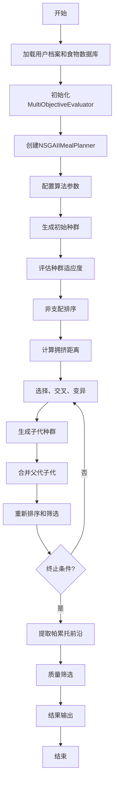
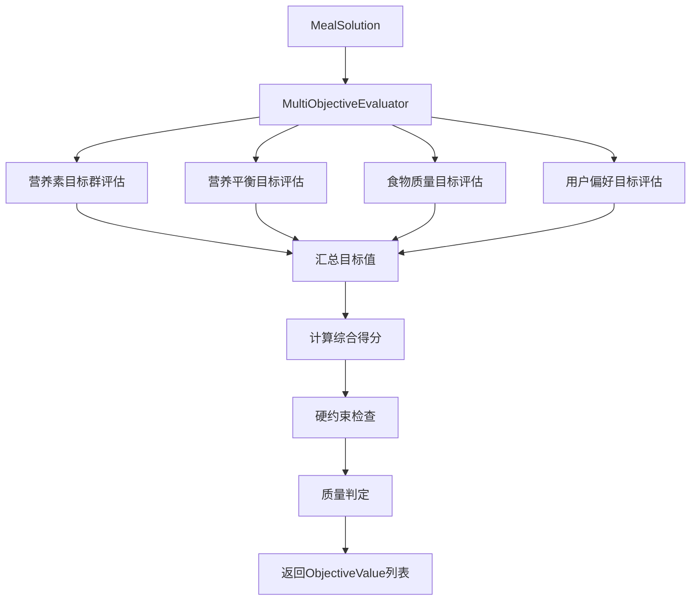

# 膳食规划系统技术方案

## 1. 系统概述

### 1.1 项目背景
膳食规划系统是一个基于多目标遗传算法（NSGA-II）的智能膳食推荐系统，旨在为用户提供个性化、营养均衡的膳食方案。系统综合考虑营养需求、食物质量、用户偏好等多个维度，通过优化算法生成帕累托最优解集。

### 1.2 技术特点
- **多目标优化**: 基于NSGA-II算法，同时优化多个冲突目标
- **个性化定制**: 根据用户身体状况、健康条件、饮食偏好定制方案
- **营养科学**: 基于营养学原理，确保膳食的营养均衡性
- **智能评估**: 四层目标评估体系，全面评价膳食质量

## 2. 系统架构

### 2.1 整体架构图
```
┌─────────────────────────────────────────────────────────────┐
│                     膳食规划系统                              │
├─────────────────────────────────────────────────────────────┤
│  用户接口层                                                   │
│  ┌─────────────────┐  ┌─────────────────┐                   │
│  │  MealPlanningService  │  │   配置管理      │                   │
│  │  (服务调度)        │  │  (AppConfig)   │                   │
│  └─────────────────┘  └─────────────────┘                   │
├─────────────────────────────────────────────────────────────┤
│  算法核心层                                                   │
│  ┌─────────────────────────────────────────────────────────┐ │
│  │           NSGAIIMealPlanner                             │ │
│  │           (NSGA-II 多目标遗传算法)                        │ │
│  └─────────────────────────────────────────────────────────┘ │
├─────────────────────────────────────────────────────────────┤
│  目标评估层                                                   │
│  ┌─────────────────────────────────────────────────────────┐ │
│  │           MultiObjectiveEvaluator                       │ │
│  │           (多目标评估器)                                  │ │
│  └─────────────────────────────────────────────────────────┘ │
├─────────────────────────────────────────────────────────────┤
│  目标实现层                                                   │
│  ┌──────────────┐ ┌──────────────┐ ┌──────────────┐         │
│  │营养素目标群   │ │营养平衡目标   │ │食物质量目标   │         │
│  │NutrientTarget│ │NutrientBalance│ │FoodQuality   │         │
│  └──────────────┘ └──────────────┘ └──────────────┘         │
│  ┌──────────────┐                                           │
│  │用户偏好目标   │                                           │
│  │UserPreference│                                           │
│  └──────────────┘                                           │
├─────────────────────────────────────────────────────────────┤
│  数据模型层                                                   │
│  ┌──────────────┐ ┌──────────────┐ ┌──────────────┐         │
│  │  MealSolution │ │  Food        │ │  UserProfile │         │
│  │  (膳食方案)    │ │  (食物)       │ │  (用户档案)   │         │
│  └──────────────┘ └──────────────┘ └──────────────┘         │
└─────────────────────────────────────────────────────────────┘
```

### 2.2 核心组件

#### 2.2.1 算法引擎 (NSGAIIMealPlanner)
- **功能**: NSGA-II多目标遗传算法的实现
- **输入**: 用户档案、食物数据库、目标营养素
- **输出**: 帕累托最优解集
- **特性**: 
  - 非支配排序
  - 拥挤距离计算
  - 精英选择策略
  - 自适应终止条件

#### 2.2.2 目标评估器 (MultiObjectiveEvaluator)
- **功能**: 统一管理和协调所有目标的评估
- **架构**: 四层目标体系
- **特性**: 
  - 可配置权重
  - 硬约束支持
  - 质量阈值管理
  - 统计信息输出

#### 2.2.3 遗传操作算子
- **选择算子**: 锦标赛选择
- **交叉算子**: 基于营养素的交叉
- **变异算子**: 营养素敏感度分析变异

## 3. 目标评估体系

### 3.1 四层目标架构

```
多目标评估器 (MultiObjectiveEvaluator)
├── 营养素目标群 (NutrientTargetObjective[])
│   ├── 主要营养素 (权重: 0.06 × 5)
│   │   ├── 热量目标
│   │   ├── 蛋白质目标  
│   │   ├── 脂肪目标
│   │   ├── 碳水化合物目标
│   │   └── 纤维目标
│   └── 微量营养素 (权重: 0.02 × 5)
│       ├── 钙目标
│       ├── 铁目标
│       ├── 维生素A目标
│       ├── 维生素C目标
│       └── 钠目标
├── 营养平衡目标 (NutrientBalanceObjective, 权重: 0.3)
│   ├── 宏量营养素比例平衡
│   ├── 热量合理性评估
│   └── 食物分量合理性
├── 食物质量目标 (FoodQualityObjective, 权重: 0.2)
│   ├── 类别多样性 (40%)
│   ├── 营养完整性 (40%)
│   └── 适度多样性 (20%)
└── 用户偏好目标 (UserPreferenceObjective, 权重: 0.2)
    ├── 安全性检查 (硬约束)
    ├── 口味偏好匹配
    └── 口味多样性
```

### 3.2 权重分配策略

| 目标类别 | 权重分配 | 设计理念 |
|---------|---------|---------|
| 营养素目标 | 50% (0.5) | 确保基础营养需求 |
| 营养平衡目标 | 30% (0.3) | 保证营养结构合理 |
| 食物质量目标 | 20% (0.2) | 提升膳食品质 |
| 用户偏好目标 | 20% (0.2) | 满足个性化需求 |

**注**: 总权重超过100%是有意设计，允许目标间的重叠和强化。

## 4. 算法流程

### 4.1 主要执行流程



### 4.2 目标评估流程



## 5. 关键技术实现

### 5.1 非支配排序 (Non-dominated Sorting)
```java
// 伪代码
for each solution in population:
    domination_count = 0
    dominated_solutions = []
    for each other_solution in population:
        if solution dominates other_solution:
            dominated_solutions.add(other_solution)
        elif other_solution dominates solution:
            domination_count++
    
    if domination_count == 0:
        solution.rank = 1
        first_front.add(solution)
```

### 5.2 拥挤距离计算 (Crowding Distance)
```java
// 伪代码
for each objective:
    sort_solutions_by_objective()
    solutions[0].distance = solutions[last].distance = INFINITY
    
    for i = 1 to solutions.length-2:
        distance = solutions[i+1].objective - solutions[i-1].objective
        solutions[i].distance += distance / objective_range
```

### 5.3 营养素评估算法
```java
// 营养素达成度评估
double ratio = actual_value / target_value;
double[] range = getNutrientRates(nutrientType);

if (ratio >= range[0] && ratio <= range[1]) {
    score = 1.0 - Math.abs(ratio - 1.0) * 0.5;  // 在合理范围内
} else if (ratio < range[0]) {
    score = ratio / range[0] * 0.5;             // 不足惩罚
} else {
    excess = (ratio - range[1]) / range[1];
    score = Math.max(0.0, 0.5 - excess * 0.3); // 过量惩罚
}
```

## 6. 性能优化策略

### 6.1 算法性能优化
- **早期终止**: 当找到足够数量的优质解时提前终止
- **精英保留**: 保留每代最优个体
- **自适应参数**: 根据进化情况调整变异率和交叉率
- **并行评估**: 多线程并行评估种群个体

### 6.2 内存优化
- **对象池**: 重用MealSolution对象
- **延迟计算**: 按需计算复杂目标值
- **缓存策略**: 缓存重复计算的营养素值

### 6.3 数据结构优化
- **高效排序**: 使用快速排序和归并排序
- **索引优化**: 为食物数据库建立分类索引
- **压缩存储**: 压缩大型配置数据

## 7. 可扩展性设计

### 7.1 目标扩展
- **接口标准化**: 所有目标实现ObjectiveEvaluator接口
- **插件机制**: 支持动态加载新的目标评估器
- **配置驱动**: 通过配置文件定义目标权重和参数

### 7.2 算法扩展  
- **策略模式**: 支持不同的选择、交叉、变异策略
- **模板方法**: 提供算法框架，支持自定义实现
- **工厂模式**: 动态创建不同类型的算法组件

### 7.3 数据源扩展
- **数据访问层**: 抽象数据访问接口
- **多格式支持**: 支持Excel、JSON、数据库等多种数据源
- **实时更新**: 支持食物数据库的动态更新

## 8. 质量保证

### 8.1 测试策略
- **单元测试**: 覆盖所有核心算法和目标评估逻辑
- **集成测试**: 验证各组件间的协作正确性
- **性能测试**: 测试大规模数据下的算法性能
- **压力测试**: 验证系统在极限条件下的稳定性

### 8.2 代码质量
- **代码规范**: 遵循Java编码规范
- **文档完整**: 提供完整的API文档和设计文档
- **静态分析**: 使用SonarQube等工具进行代码质量分析
- **持续集成**: 自动化构建、测试、部署流程

## 9. 部署和维护

### 9.1 系统要求
- **Java版本**: JDK 11或更高版本
- **内存要求**: 最小4GB，推荐8GB
- **存储空间**: 最小1GB（包含食物数据库）
- **处理器**: 多核处理器，支持并行计算

### 9.2 配置管理
- **环境配置**: 支持开发、测试、生产环境配置
- **参数调优**: 提供算法参数调优指南
- **监控告警**: 集成性能监控和异常告警机制

### 9.3 维护策略
- **版本控制**: 使用Git进行版本管理
- **数据备份**: 定期备份用户数据和配置信息
- **更新机制**: 支持在线更新食物数据库和算法参数
- **日志管理**: 完整的操作日志和错误日志记录

## 10. 技术创新点

### 10.1 多目标优化创新
- **四层目标体系**: 创新性地将膳食规划分解为四个层次的目标
- **自适应权重**: 根据用户特征动态调整目标权重
- **硬约束集成**: 将安全性要求作为硬约束集成到优化过程

### 10.2 营养学算法融合
- **营养素敏感度分析**: 基于营养学原理的变异策略
- **膳食平衡评估**: 综合考虑宏量和微量营养素的平衡
- **个性化适配**: 根据用户健康状况个性化营养目标

### 10.3 智能评估机制
- **质量阈值管理**: 动态调整解决方案质量标准
- **多维度统计**: 提供全方位的结果分析和统计
- **可解释性**: 为每个推荐结果提供详细的评估依据

这套技术方案为膳食规划系统提供了坚实的技术基础，确保系统能够生成高质量、个性化的膳食推荐方案。
